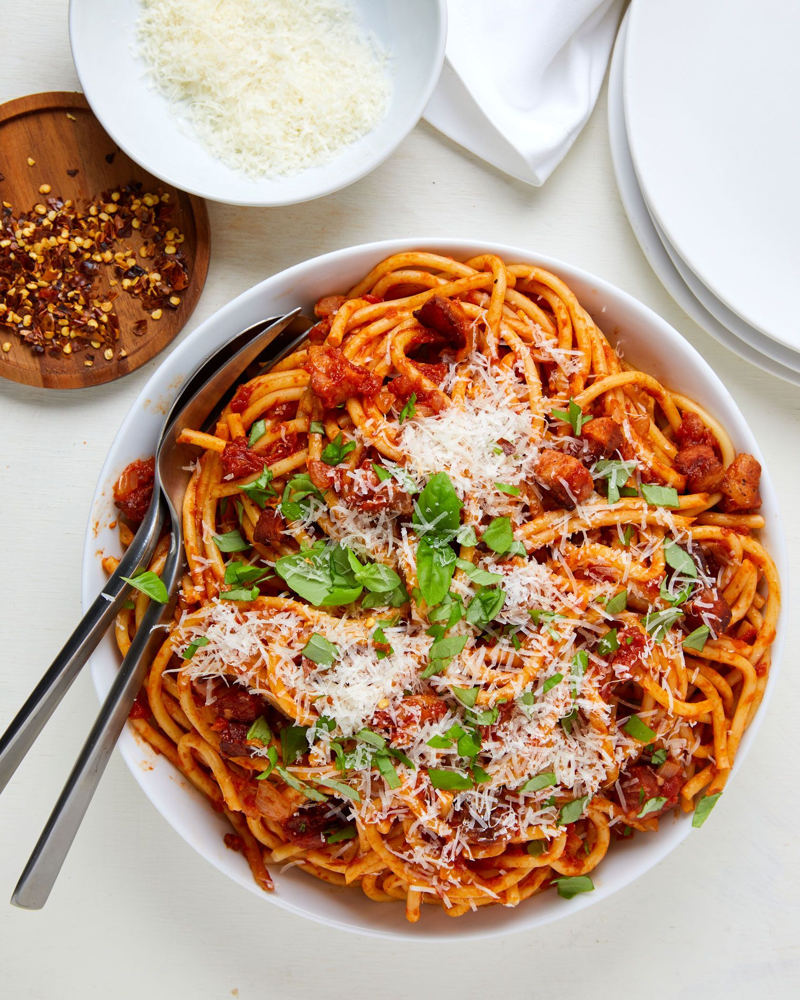
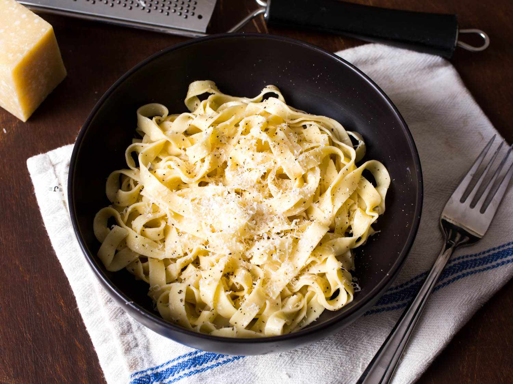
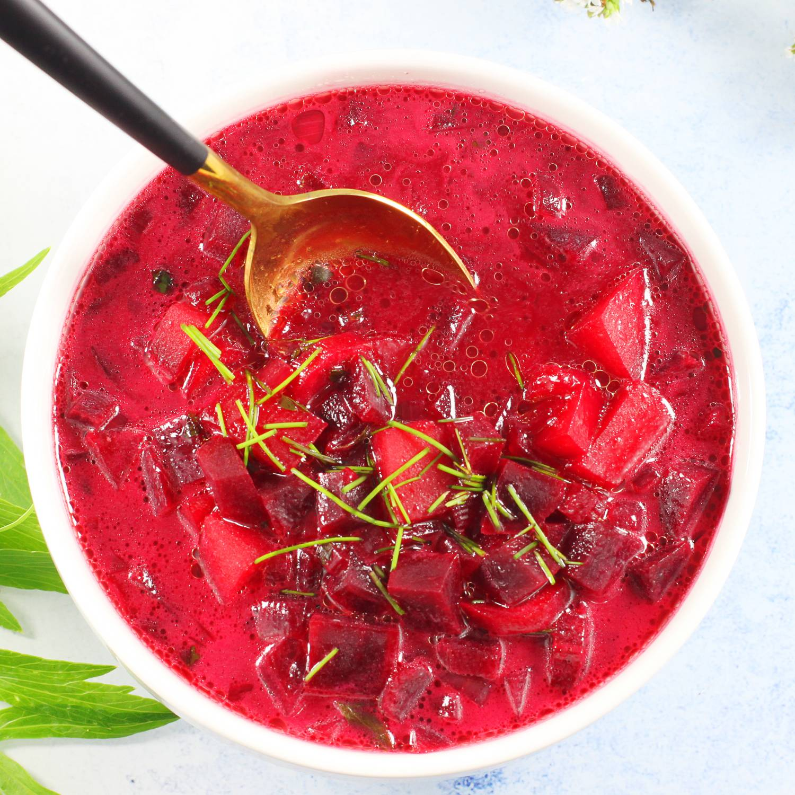
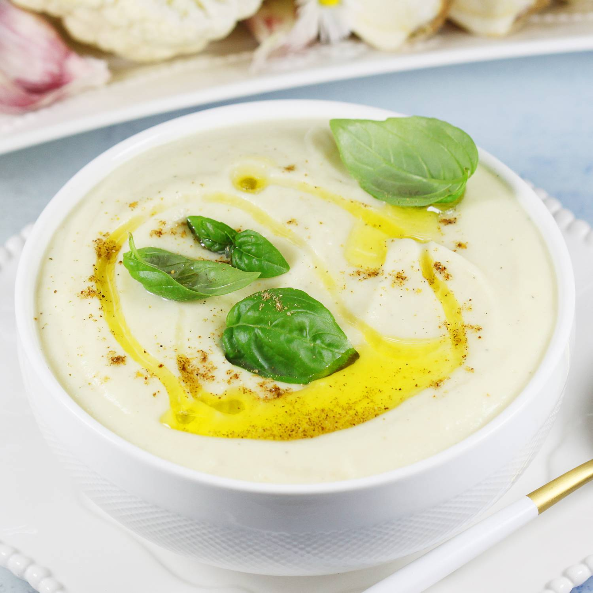
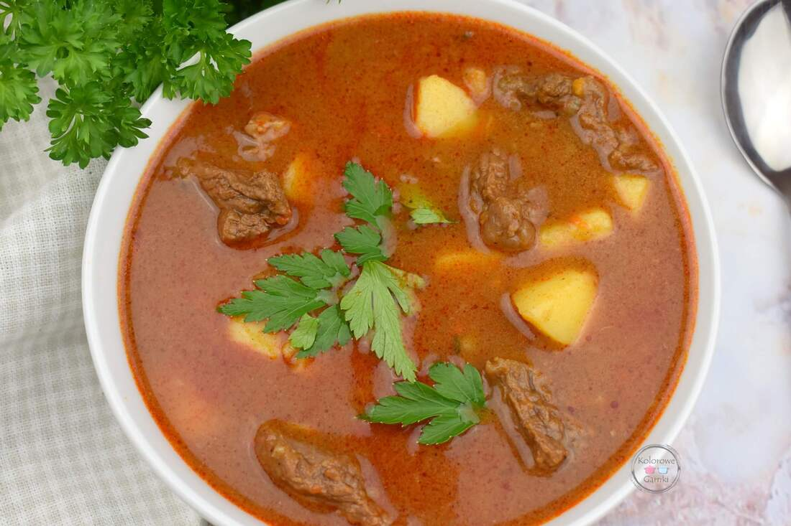
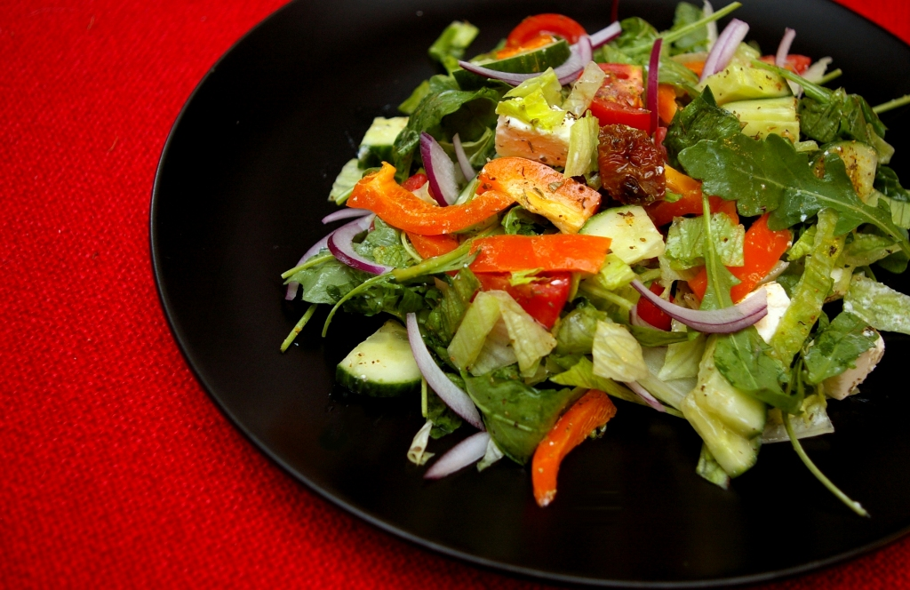
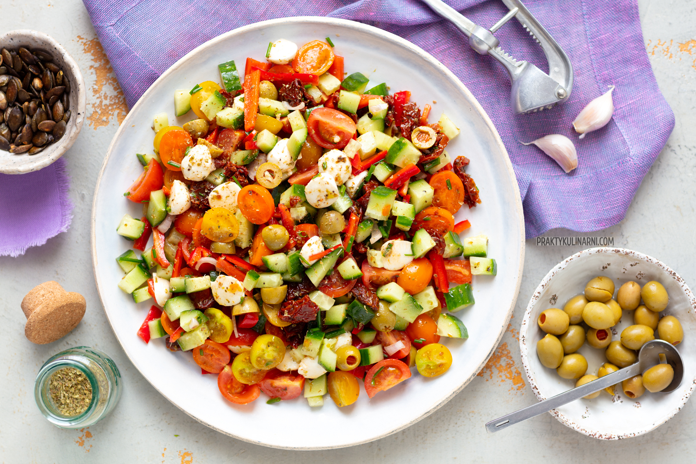
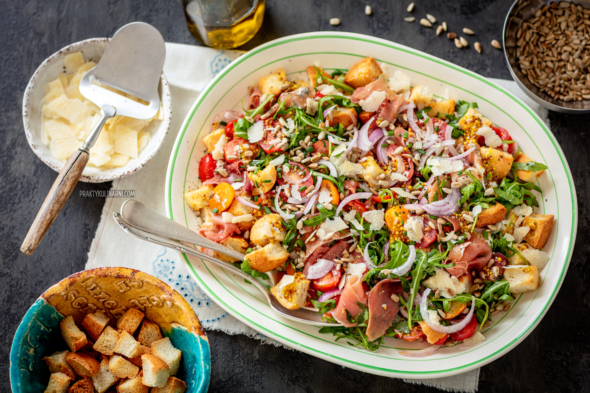

# Menu
--------------------
## Pizzy:

- Margarita *(z sosem pomidorowym, mozzarellą i bazylią) ---------------------------------------------------------------------- **20zl**

- Pepperoni *(z kiełbaskami pepperoni, sosem pomidorowym i mozzarellą) ---------------------------------------------------- **35zl**

- Wegetariańska *(z mieszanką warzyw, sosem pomidorowym i mozzarellą) ---------------------------------------------------- **29zl**

- Hawajska *(z szynką, ananasem i mozzarellą) ----------------------------------------------------------------------------------- **31zl**

- Cztery sery *(z różnymi odmianami sera, sosem pomidorowym i mozzarellą) ------------------------------------------------- **19zl**

- Pizza wegetariańska *(Pasta pomidorowa,Brokuły i Oliwki) -------------------------------------------------------------------- **29zl**

## Paste:
- Spaghetti bolognese ------------------------------------------------------------------------------------------------------------- **23zl**

- Spaghetti Napoli ----------------------------------------------------------------------------------------------------------------- **24zl**

- Lasagne Bolognese -------------------------------------------------------------------------------------------------------------- **28zl**

- Tagliatelle Forte ------------------------------------------------------------------------------------------------------------------ **13zl**

## Zupy:
- Barszcz Czysty -------------------------------------------------------------------------------------------------------------------- **9zl**

- Krem nie pomidorowy -----------------------------------------------------------------------------------------------------------  **11zl**

- Gulaszowa ------------------------------------------------------------------------------------------------------------------------ **17zl**

## Sałatki
- Sałatka Toscana *(mix sałat, pomidor, oliwa z oliwek) -------------------------------------------------------------------------- **19zl**

- Sałatka Caprese *(świeże pomidory z bazylią, oliwą i mozzarellą galbani) ----------------------------------------------------- **21zl**

- Sałatka à la cezar *(kurczak, grilowany bekon, mix sałat, oliwki, pomidor,ogórek, czerwona cebula, sos Cezar, grzanki) ---- **31zl**

## Sosy
- beszamel (sos mleczny. Jego podstawą jest mleko i biała mąka.) --------------------------------------------------------------- **5zl**
- velute (biały sos. Jego podstawą jest lekki bulion z kurczaka, cielęcia lub ryby i złocistej mąki) ------------------------------- **7zl**
- sos pomidorowy (Jego podstawą jest puree z gotowanych pomidorów. Idealny do wieprzowiny i makaronu)  --------------- **5zl**

## Napoje
|Lp.|                        Rozmiar:    | 50ml |100ml | 250ml |500 ml |700ml |
|---|------------------------------------|------|------|-------|-------|------|
|1. | woda gazowana                      |  —   | —    |   5zl |   7zl | 13 zl|
|2. | Coca-cola                          |  —   |  —   |  9zl  |  13zl | 18zl |
|3. | Sprite                             |   —  |  —   | 9zl   |  13zl |15 zl |
|4. | Herbata                            |  —   |  —   | 11zl  | 15zl  |17zl  |
|5. | Kawa                               | 10zl | 13zl |   15zl|  19zl |—     |
|6. | Piwo                               |   —  |   —  |  19zl |   29zl|—     |
|7. | Rom                                | 20zl | 35zl |  44zl | 53zl  |77zl  |

 
